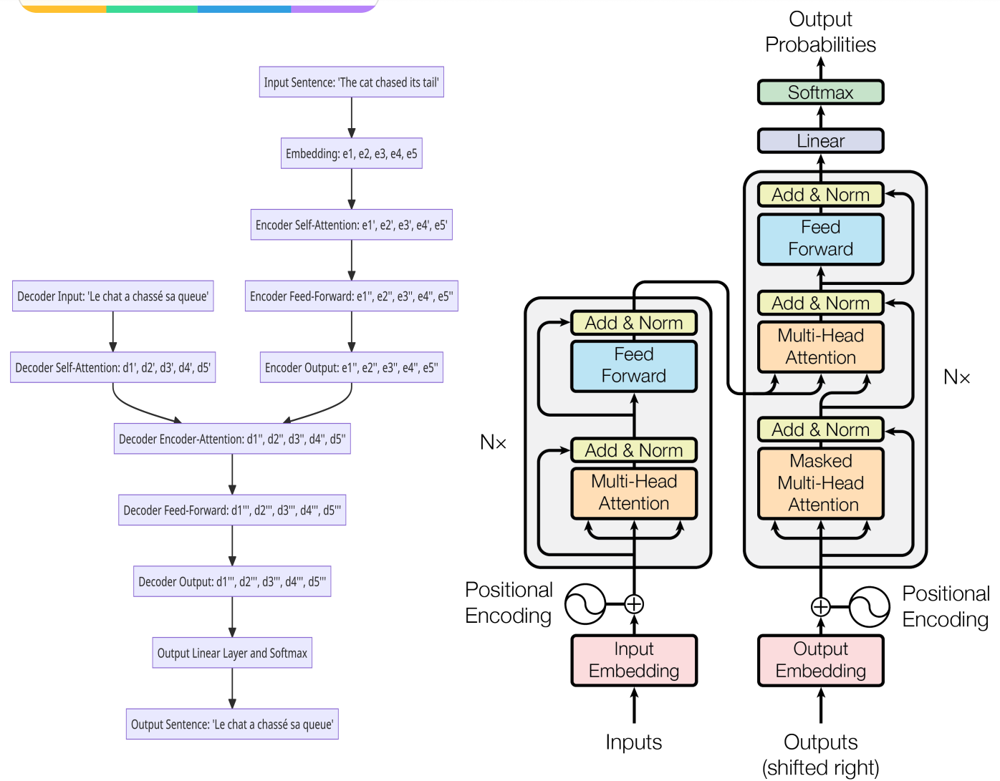

# Paper Title: Attention Is All You Need
Paper link - https://arxiv.org/pdf/1706.03762.pdf
<!--
note link - 
Category - 
-->

## Summary
1. **Abstract and Introduction:** The paper introduces the "Transformer", a novel model architecture eschewing recurrence and instead relying entirely on an attention mechanism to draw global dependencies between input and output. The Transformer is proposed as a solution to the problem of long-range dependencies in sequence transduction tasks, which is a limitation of sequence-to-sequence models based on RNNs and CNNs.
2. **Background:** The authors provide a brief overview of sequence transduction, recurrent neural networks, and the attention mechanism, which are the foundational concepts for their work.
3. **Model Architecture:** The Transformer model consists of an encoder and decoder, each composed of a stack of identical layers. Each layer has two sub-layers: a multi-head self-attention mechanism and a position-wise fully connected feed-forward network. Residual connections and layer normalization are employed around each of the two sub-layers.
4. **Attention:** The authors describe the scaled dot-product attention and multi-head attention mechanisms used in their model. The attention function is used to compute a weighted sum of values based on the dot product of the query and key.
5. **Position-wise Feed-Forward Networks:** Each of the layers in the encoder and decoder contains a fully connected feed-forward network, which is applied to each position separately and identically.
6. **Embeddings and Softmax:** The model uses learned embeddings to convert the input tokens and output tokens to vectors of dimension d_model. The same weight matrix is shared between the two embedding layers and the pre-softmax linear transformation.
7. **Positional Encoding:** Since the model doesn't contain recurrence or convolution, positional encodings are added to the input embeddings to indicate the position of the words in the sequence.
8. **Why Self-Attention:** The authors discuss the advantages of the self-attention mechanism, such as its ability to handle long-range dependencies, its parallelizability, and its capacity to model various types of dependencies.
9. **Training:** The authors describe the training process, including the use of residual dropout, label smoothing, and a custom learning rate scheduler.
10. **Results:** The Transformer model achieves state-of-the-art performance on the WMT 2014 English-to-German and English-to-French translation tasks. The authors also conduct an ablation study to understand the importance of different components of the model.

**FAQs:**

1. **What are Q, K, and V in the context of the Transformer model?**
    - Q, K, and V stand for Query, Key, and Value, respectively. These are vectors created by the model for each word in the input sequence. The Query and Key vectors are used to calculate the attention scores, and the Value vector is used to create the final output representation of each word.
2. **Why do we need to multiply the attention scores with the Value vectors in the scaled dot-product attention mechanism?**
    - The multiplication of the attention scores with the Value vectors helps to give more importance to the words that are most relevant to the current word being processed. This is the essence of the attention mechanism: to focus more on relevant parts of the input when generating the output.
3. **How does multi-head attention work and why is it useful?**
    - Multi-head attention allows the model to focus on different positions and capture various aspects of the input information. It does this by applying the attention mechanism multiple times in parallel. This can help the model to learn different types of dependencies in the data.
4. **What is the purpose of the position-wise feed-forward networks in the Transformer model?**
    - The position-wise feed-forward networks are used to transform the output of the multi-head attention mechanism. They consist of two linear transformations with a ReLU activation in between. These networks are applied identically to each position, allowing the model to learn complex patterns within the sequence.
5. **What is the role of positional encoding in the Transformer model?**
    - Positional encoding is used to inject information about the relative or absolute position of the words in the sequence into the model. This is important because the Transformer does not have any inherent notion of word order due to its lack of recurrence and convolution.
6. **What is label smoothing and how does it affect the model's performance?**
    - Label smoothing is a regularization technique that prevents the model from becoming too confident about the labels in the training data. It can increase perplexity because it prevents the model from assigning full probability to the correct label, but it can improve accuracy and BLEU score by preventing overfitting and helping the model generalize better to unseen data.
7. **How does the Transformer model compare to other models like RNNs and CNNs?**
    - The Transformer model outperforms other models on several benchmark tasks. It is particularly effective at handling long-range dependencies in sequence data, which is a limitation of RNNs and CNNs. The Transformer also has advantages in terms of computational efficiency due to its parallelizability.

**Key Takeaways and Novelty:**

The Transformer model is a novel architecture for sequence transduction tasks like machine translation. It relies entirely on an attention mechanism, specifically a variant called "scaled dot-product attention", and does not use any recurrence or convolution. This allows it to handle long-range dependencies in sequence data effectively.

The model also introduces multi-head attention, which allows it to focus on different positions and capture various aspects of the input information. Positional encodings are used to provide information about word order, which is not inherently captured by the model.

The Transformer model achieves state-of-the-art performance on several benchmark tasks, demonstrating its effectiveness. The authors also provide a detailed analysis of the model's components and their contributions to its performance.

The Transformer model's design reflects a shift away from the previously dominant sequence transduction models based on RNNs and CNNs, and it has since become a foundational model for many tasks in natural language processing, including the development of models like BERT and GPT-3.

## Diagram
see in original paper https://arxiv.org/pdf/1706.03762.pdf

## Detail Notes
**1. Introduction**

The introduction discusses the current state of sequence transduction models, which are based on recurrent neural networks (RNNs) or convolutional neural networks (CNNs). These models typically include an encoder and a decoder, and the best performing models also include an attention mechanism. However, these models have a limitation: they are inherently sequential, which prevents parallelization within training examples and can be a problem for longer sequence lengths.

The authors propose a new model architecture, the Transformer, which relies entirely on an attention mechanism and does not use recurrence or convolutions. This allows for significantly more parallelization and can reach a new state of the art in translation quality after being trained for as little as twelve hours on eight P100 GPUs.

**2. Background**

The authors discuss previous work that has attempted to reduce sequential computation in sequence transduction models, such as the Extended Neural GPU, ByteNet, and ConvS2S, which use convolutional neural networks. However, these models still have a limitation: the number of operations required to relate signals from two arbitrary input or output positions grows with the distance between positions, making it more difficult to learn dependencies between distant positions.

The Transformer addresses this limitation by reducing the number of operations to a constant number, regardless of the distance between positions. This is achieved by using a self-attention mechanism, which relates different positions of a single sequence in order to compute a representation of the sequence.

**3. Model Architecture**

The authors describe the architecture of the Transformer, which follows an encoder-decoder structure. The encoder maps an input sequence of symbol representations to a sequence of continuous representations. Given these continuous representations, the decoder generates an output sequence of symbols one element at a time.

The Transformer uses stacked self-attention and point-wise, fully connected layers for both the encoder and decoder. The encoder is composed of a stack of identical layers, each of which has two sub-layers: a multi-head self-attention mechanism and a simple, position-wise fully connected feed-forward network. The decoder also has a stack of identical layers, but in addition to the two sub-layers in each encoder layer, the decoder includes a third sub-layer, which performs multi-head attention over the output of the encoder stack.

**4. Attention**

The authors describe the concept of attention in more detail. An attention function maps a query and a set of key-value pairs to an output, where the query, keys, values, and output are all vectors. The output is computed as a weighted sum of the values, where the weight assigned to each value is computed by a compatibility function of the query with the corresponding key.

The authors introduce a specific type of attention called "Scaled Dot-Product Attention". The input consists of queries and keys of a certain dimension, and values of another dimension. The dot products of the query with all keys are computed, divided by the square root of the dimension of the keys, and a softmax function is applied to obtain the weights on the values.

The authors also introduce "Multi-Head Attention", which allows the model to attend to information from different representation subspaces at different positions. This is achieved by linearly projecting the queries, keys, and values multiple times with different, learned linear projections, and then performing the attention function in parallel on each of these projected versions.

**5. Position-wise Feed-Forward Networks (Continued)**

The authors explain that they use learned embeddings to convert the input tokens and output tokens to vectors of dimension d_model. They also use the usual learned linear transformation and softmax function to convert the decoder output to predicted next-token probabilities. In the embedding layers, they multiply those weights by √d_model.

**6. Positional Encoding**

Since the Transformer model contains no recurrence and no convolution, in order for the model to make use of the order of the sequence, they must inject some information about the relative or absolute position of the tokens in the sequence. To this end, they add "positional encodings" to the input embeddings at the bottoms of the encoder and decoder stacks. The positional encodings have the same dimension d_model as the embeddings, so that the two can be summed.

In this work, they use sine and cosine functions of different frequencies for positional encoding. They chose this function because they hypothesized it would allow the model to easily learn to attend by relative positions, since for any fixed offset k, PE_pos+k can be represented as a linear function of PE_pos.

**7. Why Self-Attention**

In this section, the authors compare various aspects of self-attention layers to the recurrent and convolutional layers commonly used for mapping one variable-length sequence of symbol representations to another sequence of equal length. They consider three desiderata:

1. The total computational complexity per layer.
2. The amount of computation that can be parallelized, as measured by the minimum number of sequential operations required.
3. The path length between long-range dependencies in the network.

The authors note that a self-attention layer connects all positions with a constant number of sequentially executed operations, whereas a recurrent layer requires O(n) sequential operations. In terms of computational complexity, self-attention layers are faster than recurrent layers when the sequence length n is smaller than the representation dimensionality d, which is most often the case with sentence representations used by state-of-the-art models in machine translations.

**8. Training**

The authors describe the training regime for their models. They trained on the standard WMT 2014 English-German dataset consisting of about 4.5 million sentence pairs. Sentences were encoded using byte-pair encoding, which has a shared source-target vocabulary of about 37000 tokens. For English-French, they used the significantly larger WMT 2014 English-French dataset consisting of 36M sentences and split tokens into a 32000 word-piece vocabulary. Sentence pairs were batched together by approximate sequence length. Each training batch contained a set of sentence pairs containing approximately 25000 source tokens and 25000 target tokens.

They trained their models on one machine with 8 NVIDIA P100 GPUs. For their base models using the hyperparameters described throughout the paper, each training step took about 0.4 seconds. They trained the base models for a total of 100,000 steps or 12 hours. For their big models, step time was 1.0 seconds. The big models were trained for 300,000 steps (3.5 days).

They used the Adam optimizer with β1 = 0.9, β2 = 0.98 and ε = 10^-9. They varied the learning rate over the course of training, according to a formula that corresponds to increasing the learning rate linearly for the first warmup_steps training steps, and decreasing it thereafter proportionally to the inverse square root of the step number. They used warmup_steps = 4000.

They employed three types of regularization during training: Residual Dropout, where they apply dropout to the output of each sub-layer, before it is added to the sub-layer input and normalized, and Label Smoothing, where during training, they employed label smoothing of value ls = 0.1. This hurts perplexity, as the model learns to be more unsure, but improves accuracy and BLEU score.

**9. Results**

The authors present the results of their experiments with the Transformer model. On the WMT 2014 English-to-German translation task, the big transformer model outperforms the best previously reported models (including ensembles) by more than 2.0 BLEU, establishing a new state-of-the-art BLEU score of 28.4. The configuration of this model is listed in the bottom line of Table 3. Training took 3.5 days on 8 P100 GPUs. Even their base model surpasses all previously published models and ensembles, at a fraction of the training cost of any of the competitive models.

On the WMT 2014 English-to-French translation task, their big model achieves a BLEU score of 41.0, outperforming all of the previously published single models, at less than 1/4 the training cost of the previous state-of-the-art model. The Transformer (big) model trained for English-to-French used dropout rate P_drop = 0.1, instead of 0.3.

**10. Model Variations**

To evaluate the importance of different components of the Transformer, the authors varied their base model in different ways, measuring the change in performance on English-to-German translation on the development set, newstest2013. They used beam search as described in the previous section, but no checkpoint averaging. They present these results in Table 3.

**11. English Constituency Parsing**

To evaluate if the Transformer can generalize to other tasks they performed experiments on English constituency parsing. This task presents specific challenges: the output is subject to strong structural constraints and is significantly longer than the input. Furthermore, RNN sequence-to-sequence models have not been able to attain state-of-the-art results in small-data regimes.

Their results show that despite the lack of task-specific tuning their model performs surprisingly well, yielding better results than all previously reported models with the exception of the Recurrent Neural Network Grammar.

**12. Conclusion**

In conclusion, the authors state that for translation tasks, the Transformer can be trained significantly faster than architectures based on recurrent or convolutional layers. On both WMT 2014 English-to-German and WMT 2014 English-to-French translation tasks, they achieve a new state of the art. They are excited about the future of attention-based models and plan to apply them to other tasks. They plan to extend the Transformer to problems involving input and output modalities other than text and to investigate local, restricted attention mechanisms to efficiently handle large inputs and outputs such as images, audio and video. Making generation less sequential is another research goal of theirs.

The code they used to train and evaluate their models is available at **https://github.com/tensorflow/tensor2tensor**.

## Detailed FAQ
How could multi-head attention learn different representation paralleling? Could these parallel attentions end up to learn the same thing? How to avoid that?

It is achieved is by applying different learned linear transformations to the queries, keys, and values before feeding them into the attention mechanism. These transformations are learned during the training process, and they allow each head to potentially focus on different aspects of the input.

As for the question of whether these parallel attentions could end up learning the same thing, it's theoretically possible, but in practice, it's unlikely due to the way the model is trained. The model is trained to minimize the difference between its predictions and the actual output (the loss), and having multiple heads that all learn the same thing would not be an efficient way to achieve this. Instead, the model is incentivized to have each head learn something different that contributes to minimizing the loss.

One way to further ensure that the heads learn different things is to use regularization techniques during training. For example, a common technique is to add a penalty to the loss function that encourages the model to have different weights in different parts of the model. This can help to ensure that the different heads in the multi-head attention mechanism learn to focus on different things.

In summary, the multi-head attention mechanism allows the Transformer model to focus on different types of information in parallel, and the model is trained in such a way that encourages each head to learn something different. This allows the model to capture a richer set of information from the input sequence, which can lead to better performance on complex tasks like translation.

3.3 Position-wise Feed-Forward Networks

What is the inner-layer here?

The inner-layer here refers to the hidden layer in the feed-forward network. The input to this network is transformed into a higher-dimensional space (2048 dimensions), processed through the ReLU activation function, and then transformed back to the original dimensionality (512 dimensions). This kind of architecture, where the hidden layer has higher dimensionality than the input/output layers, is common in feed-forward neural networks.

Why there is 4 times multipler between the dimensionality of input and output and inner-layer? 

The reason for this design choice is that the transformation to a higher-dimensional space can make the model more expressive. It allows the model to learn more complex patterns in the data. The specific choice of a 4 times multiplier (d_ff = 4 * d_model) is a hyperparameter of the model, and it was likely chosen based on empirical performance on the training data.

What does it mean by "This consists of two linear transformations with a ReLU activation in between." in the section?

Here's a breakdown of what this means:

1. **Linear Transformation**: A linear transformation in this context refers to a linear operation applied to the input data. In terms of neural networks, this is typically done by multiplying the input data by a weight matrix and then adding a bias vector. The weight matrix and bias vector are learned parameters of the model. In the Transformer model, there are two of these linear transformations in each feed-forward network.
2. **ReLU Activation**: ReLU stands for Rectified Linear Unit. It's a type of activation function, which is a function applied to the output of a neural network layer. The purpose of an activation function is to introduce non-linearity into the model, allowing it to learn more complex patterns. The ReLU function is defined as ReLU(x) = max(0, x), meaning that it outputs x if x is positive, and 0 otherwise.

So, when the paper says the feed-forward network consists of "two linear transformations with a ReLU activation in between", it means that the network takes its input, applies a linear transformation, then applies the ReLU function, and then applies another linear transformation. The output of this second linear transformation is the output of the feed-forward network. This structure is applied independently to each position in the input sequence (hence the term "position-wise").

Why do we need two linear transformations in this process? Why do we do position-wise? What are the benefits and drawbacks?

The two linear transformations in the feed-forward network of the Transformer model serve to increase the model's expressiveness and capacity to learn complex patterns.

The first linear transformation increases the dimensionality of the data from d_model to d_ff (where d_ff > d_model), creating a higher-dimensional representation of the data. This higher-dimensional space allows the model to learn more complex features. The ReLU activation function then introduces non-linearity, enabling the model to capture complex relationships in the data. The second linear transformation reduces the dimensionality back to d_model, producing a new representation of the data that can be used in subsequent layers of the model.

The reason for applying these transformations "position-wise" (i.e., independently to each position in the input sequence) is to maintain the model's ability to process sequences of varying lengths and to focus on the individual elements of the sequence. This is in contrast to other types of layers (like convolutional or recurrent layers) that apply the same transformation to the entire sequence or combine information across different positions in the sequence.

The benefits of this approach include:

1. **Flexibility**: The model can handle sequences of any length, and it can focus on individual elements of the sequence.
2. **Parallelism**: Because the transformations are applied independently to each position, they can be computed in parallel, which can lead to significant speedups in training and inference.
3. **Expressiveness**: The two linear transformations, combined with the ReLU activation function, allow the model to learn complex patterns in the data.

The potential drawbacks include:

1. **Increased Complexity**: The use of two linear transformations increases the number of parameters in the model, which can make the model more complex and potentially harder to train.
2. **Lack of Recurrent Structure**: Unlike recurrent neural networks (RNNs), the Transformer model does not have an inherent recurrent structure, which can make it less effective at capturing long-term dependencies in the data. However, the Transformer model mitigates this issue through the use of self-attention, which allows it to focus on different parts of the input sequence regardless of their distance from the current position.

In section "3.4 Embeddings and Softmax",  why we do this? "In the embedding layers, we multiply those weights by √dmodel.”

The multiplication of the embedding weights by √d_model is a scaling operation that is done to maintain a certain variance in the embeddings and prevent them from becoming too small.

The dimensionality of the embeddings, d_model, is typically quite large (e.g., 512 in the original Transformer model). When you're dealing with high-dimensional vectors, the length (or norm) of these vectors can become quite large. This is a consequence of the Pythagorean theorem: the length of a vector is the square root of the sum of the squares of its components. So, in high dimensions, even if each component of the vector is small, the length of the vector can be large.

By scaling the embeddings by √d_model, the authors ensure that the norm of the embedding vectors stays roughly the same regardless of the dimensionality. This helps to stabilize the learning process and prevent the model's parameters from exploding or vanishing, which can happen if the values become too large or too small.

It's worth noting that this scaling operation is a heuristic, and like many aspects of deep learning models, it's based on empirical results rather than a theoretical guarantee. Different scaling factors (or no scaling at all) might work better for different tasks or datasets.

Can you use example  "The cat chased its tail" to illustrate the 4 points above of advantages and disadvantages of self-attention by comparing the RNN and CNN models side by side with math detail walk through?

1. **Computational Efficiency**:
    - In an RNN, each word in the sentence would have to be processed sequentially. For instance, "The" would be processed first, followed by "cat", "chased", "its", and finally "tail". This means the RNN has to perform 5 operations in sequence.
    - In a CNN, the sentence would be processed in chunks depending on the kernel size. For instance, if the kernel size is 2, the CNN would process "The cat", "cat chased", "chased its", and "its tail" - a total of 4 operations.
    - In contrast, a self-attention mechanism would process all words at once. It would compute the attention scores for all pairs of words in one operation, making it more computationally efficient.
2. **Parallelization**:
    - In an RNN, due to the sequential nature of the model, it's hard to parallelize the operations. The next operation usually depends on the output of the previous operation.
    - In a CNN, although operations on different chunks can be parallelized, the operations within a chunk are still sequential.
    - In contrast, self-attention allows for parallelization of operations as the attention scores for all pairs of words can be computed independently.
3. **Long-range Dependencies**:
    - In an RNN, capturing long-range dependencies can be challenging due to the "vanishing gradient" problem. For instance, the relationship between "cat" and "tail" might be hard to capture as they are far apart.
    - In a CNN, the ability to capture long-range dependencies depends on the kernel size. A larger kernel size can capture longer dependencies but at the cost of increased computational complexity.
    - In contrast, self-attention can easily capture long-range dependencies as it computes attention scores for all pairs of words, regardless of their distance.
4. **Interpretability**:
    - In both RNNs and CNNs, it's hard to interpret what the model has learned due to the complex transformations and non-linearities involved.
    - In contrast, self-attention provides an attention score for each pair of words, which can be interpreted as the importance of a word in the context of another word. For instance, when processing the word "chased", the model might assign high attention scores to "cat" and "tail", indicating that these words are important in understanding the context of "chased".

In terms of computational complexity, both RNNs and CNNs can be more expensive than self-attention, especially for longer sequences. However, for very long sequences, self-attention might also become expensive as it computes attention scores for all pairs of words. This is where techniques like "windowed" or "restricted" self-attention, which only considers a neighborhood around each word, can be useful.

How Residual Dropout works in Transformer? Can you use the example "The cat chased its tail" to walk me through how Dropout applied in the both encoder and decoder stacks?

Dropout is a regularization technique used in neural networks to prevent overfitting. It works by randomly setting a fraction of input units to 0 at each update during training time. The fraction is determined by the dropout rate. For example, a dropout rate of 0.1 would zero out 10% of input units.

In the Transformer model, dropout is applied in several places:

1. **Residual connections**: After each sub-layer (self-attention or feed-forward) in the encoder and decoder stacks, the output of the sub-layer is added to its input (this is the "residual" connection), and then dropout is applied. This means that some of the information from the sub-layer's output is randomly omitted, which encourages the model to spread out its learned representations and makes it more robust to noise in the input.
2. **Embeddings**: Dropout is also applied to the sum of the token embeddings and the positional encodings at the start of the encoder stack.
3. **Decoder**: In the decoder, dropout is applied after the second (encoder-decoder) attention sub-layer, just like in the encoder.

Let's walk through how dropout would be applied in the encoding of the sentence "The cat chased its tail":

1. The sentence is first converted into token embeddings. Let's denote the embeddings for "The", "cat", "chased", "its", "tail" as e1, e2, e3, e4, e5 respectively.
2. Positional encodings are added to the embeddings, resulting in e1', e2', e3', e4', e5'.
3. Dropout is applied to these sums. Let's say we have a dropout rate of 0.1, and the dropout operation zeroes out e2' and e4'. We're left with e1', 0, e3', 0, e5'.
4. These go through the self-attention sub-layer, resulting in e1'', 0, e3'', 0, e5''.
5. Dropout is applied again to these outputs. This time, let's say e3'' is zeroed out. We're left with e1'', 0, 0, 0, e5''.
6. These go through the feed-forward sub-layer, resulting in e1''', 0, 0, 0, e5'''.
7. Dropout is applied once more. If e1''' is zeroed out this time, we're left with 0, 0, 0, 0, e5'''.
8. This process is repeated for each layer in the encoder stack.

In the decoder, the process is similar, but there's an additional step where dropout is applied after the encoder-decoder attention sub-layer. The key point is that dropout is applied after each sub-layer and after the embeddings are added to the positional encodings, which helps prevent overfitting and makes the model more robust.