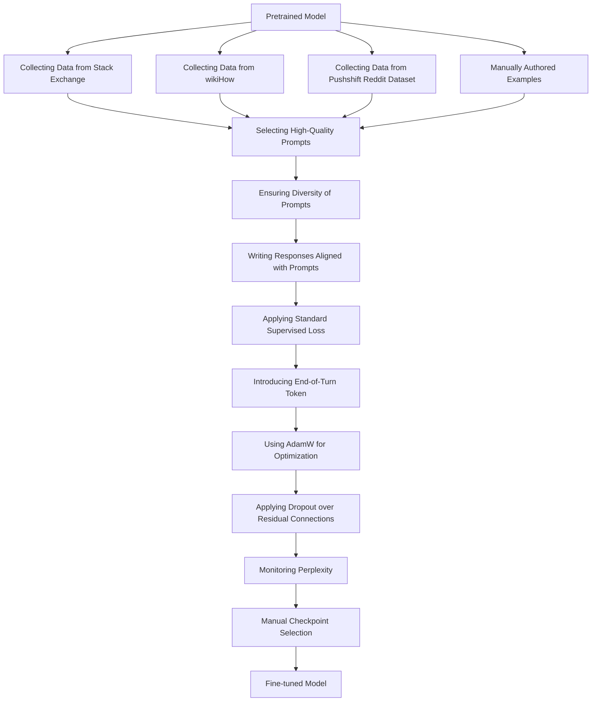

# Paper Title: LIMA: Less Is More for Alignment
Paper link - https://arxiv.org/pdf/2305.11206.pdf
<!--
note link - https://github.com/chuckhelios/generative-ai-papers/blob/main/large_language_models_fine_tuning/LIMA%3A%20Less%20Is%20More%20for%20Alignment.md
Category - Fine Tuning Large Language Model
-->

## Summary

1. **Abstract & Introduction**: The authors propose LIMA, a 65B parameter language model fine-tuned with the standard supervised loss on only 1,000 carefully curated prompts and responses. They suggest that most knowledge in large language models is learned during pretraining, and only limited instruction tuning data is necessary to produce high-quality output.
2. **Alignment Data & Training LIMA**: The authors collect a dataset of 1,000 prompts and responses, where the outputs (responses) are stylistically aligned with each other, but the inputs (prompts) are diverse. They fine-tune LIMA, starting from a 65B parameter language model, on this alignment training set. They introduce a special end-of-turn token (EOT) at the end of each utterance to differentiate between each speaker (user and assistant).
3. **Human Evaluation & Experiment Setup**: The authors evaluate LIMA by comparing it to state-of-the-art language models and find that it outperforms OpenAI's RLHF-based DaVinci003 and a 65B-parameter reproduction of Alpaca trained on 52,000 examples. They find that 50% of LIMA's outputs are considered excellent.
4. **Results & Analysis**: The results of their human preference study show that, despite training on 52 times more data, Alpaca 65B tends to produce less preferable outputs than LIMA. The same is true for DaVinci003. Bard produces better responses than LIMA 42% of the time; however, this also means that 58% of the time the LIMA response was at least as good as Bard.
5. **Multi-turn Dialogue**: The authors test LIMA across 10 live conversations, labeling each response as Fail, Pass, or Excellent. LIMA responses are surprisingly coherent for a zero-shot chatbot, referencing information from previous steps in the dialogue. However, in 6 out of 10 conversations, LIMA fails to follow the prompt within 3 interactions. To improve its ability to converse, they gather 30 multi-turn dialogue chains and fine-tune a new version of LIMA from the pretrained LLaMa model using the combined 1,030 examples.
6. **Discussion**: The authors show that fine-tuning a strong pretrained language model on 1,000 carefully curated examples can produce remarkable, competitive results on a wide range of prompts. However, there are limitations to this approach. Primarily, the mental effort in constructing such examples is significant and difficult to scale up. Secondly, LIMA is not as robust as product-grade models; while LIMA typically generates good responses, an unlucky sample during decoding or an adversarial prompt can often lead to a weak response.

In summary, the paper presents a novel approach to fine-tuning language models, demonstrating that with careful curation of a small number of examples, it's possible to achieve competitive results. The authors' work challenges the conventional wisdom that large-scale instruction tuning and reinforcement learning are necessary for high-quality language model outputs, and instead proposes a simpler, more efficient method.

## Diagram

## Detail Notes

**Abstract**

The abstract provides a summary of the paper. The authors state that large language models are trained in two stages: unsupervised pretraining from raw text and large scale instruction tuning and reinforcement learning. They introduce LIMA, a 65B parameter language model fine-tuned with the standard supervised loss on only 1,000 carefully curated prompts and responses. The model demonstrates strong performance and generalizes well to unseen tasks. In a controlled human study, responses from LIMA are either equivalent or strictly preferred to GPT-4 in 43% of cases. These results suggest that most knowledge in large language models is learned during pretraining, and only limited instruction tuning data is necessary to produce high-quality output.

**Introduction**

The introduction explains the background and motivation for the study. Language models are pretrained to predict the next token at a large scale, allowing them to learn general-purpose representations that can be transferred to nearly any language understanding or generation task. Existing alignment methods require significant amounts of compute and specialized data to achieve ChatGPT-level performance. However, the authors hypothesize that alignment can be a simple process where the model learns the style or format for interacting with users, to expose the knowledge and capabilities that were already acquired during pretraining. To test this hypothesis, they curate 1,000 examples that approximate real user prompts and high-quality responses.

**Alignment Data**

In this section, the authors define the Superficial Alignment Hypothesis: A model's knowledge and capabilities are learnt almost entirely during pretraining, while alignment teaches it which subdistribution of formats should be used when interacting with users. They collect a dataset of 1,000 prompts and responses, where the outputs (responses) are stylistically aligned with each other, but the inputs (prompts) are diverse. They curate such examples from a variety of sources, primarily split into community Q&A forums and manually authored examples.

**Community Questions & Answers**

The authors collect data from three community Q&A websites: Stack Exchange, wikiHow, and the Pushshift Reddit Dataset. They apply both quality and diversity controls when sampling from these sources. They also manually select examples from within the most upvoted posts in each community.

**Manually Authored Examples**

To further diversify their data beyond questions asked by users in online communities, they collect prompts from themselves (the authors of this work). They also include 13 training prompts with some degree of toxicity or malevolence. They carefully write responses that partially or fully reject the command, and explain why the assistant will not comply.

**Training LIMA**

The authors fine-tune LIMA, starting from a 65B parameter language model, on their 1,000-example alignment training set. They introduce a special end-of-turn token (EOT) at the end of each utterance to differentiate between each speaker (user and assistant). They follow standard fine-tuning hyperparameters and use AdamW for optimization. They also apply dropout over residual connections, starting at 0.0 at the bottom layer and linearly raising the rate to 0.3 at the last layer. They find that perplexity does not correlate with generation quality, and thus manually select checkpoints using a held-out 50-example development set.

**Human Evaluation**

The authors evaluate LIMA by comparing it to state-of-the-art language models and find that it outperforms OpenAI's RLHF-based DaVinci003 and a 65B-parameter reproduction of Alpaca trained on 52,000 examples. They find that 50% of LIMA's outputs are considered excellent. These results strongly support the Superficial Alignment Hypothesis, demonstrating the power of pretraining and its relative importance over large-scale instruction tuning and reinforcement learning approaches.

**Experiment Setup**

To compare LIMA to other models, they generate a single response for each test prompt and ask crowd workers to compare LIMA outputs to each of the baselines and label which one they prefer. They repeat this experiment, replacing human crowd workers with GPT-4, finding similar agreement levels.

**Baselines**

They compare LIMA to five baselines: Alpaca 65B, OpenAI's DaVinci003, Google's Bard, and others. For each prompt, they generate a single response from each baseline model using nucleus sampling.

**Methodology**

At each step, they present annotators with a single prompt and two possible responses, generated by different models. The annotators are asked to label which response was better, or whether neither response was significantly better than the other. They collect parallel annotations by providing GPT-4 with exactly the same instructions and data.

**Inter-Annotator Agreement**

They compute inter-annotator agreement using tie-discounted accuracy. They measure agreement over a shared set of 50 annotation examples, comparing author, crowd, and GPT-4 annotations. They also measure the agreement between GPT-4 and humans.

**Results**

The results of their human preference study show that, despite training on 52 times more data, Alpaca 65B tends to produce less preferable outputs than LIMA. The same is true for DaVinci003. Bard produces better responses than LIMA 42% of the time; however, this also means that 58% of the time the LIMA response was at least as good as Bard. Finally, they see that while Claude and GPT-4 generally perform better than LIMA, there is a non-trivial amount of cases where LIMA does actually produce better responses.

**Analysis**

They provide an absolute assessment by manually analyzing 50 random examples. They label each example into one of three categories: Fail, Pass, and Excellent. They find that 50% of LIMA answers are considered excellent, and that it is able to follow all but 6 of the 50 analyzed prompts.

**Out of Distribution**

They analyze 13 additional out-of-distribution examples and find that 20% of responses fail, 35% pass, and 45% are excellent. This suggests that LIMA is able to generalize well.

**Multi-turn Dialogue**

The authors test LIMA across 10 live conversations, labeling each response as Fail, Pass, or Excellent. LIMA responses are surprisingly coherent for a zero-shot chatbot, referencing information from previous steps in the dialogue. However, in 6 out of 10 conversations, LIMA fails to follow the prompt within 3 interactions. To improve its ability to converse, they gather 30 multi-turn dialogue chains and fine-tune a new version of LIMA from the pretrained LLaMa model using the combined 1,030 examples. They conduct 10 live conversations based on the same prompts used for the zero-shot model.

Adding conversations substantially improves generation quality, raising the proportion of excellent responses from 45.2% to 76.1%. Moreover, the failure rate drops from 15 fails per 42 turns (zero-shot) to 1 fail per 46 (fine-tuned). They further compare the quality of the entire dialogue, and find that the fine-tuned model was significantly better in 7 out of 10 conversations, and tied with the zero-shot model in 3. This leap in capability from a mere 30 examples, as well as the fact that the zero-shot model can converse at all, reinforces the hypothesis that such capabilities are learned during pretraining, and can be invoked through limited supervision.

**Discussion**

The authors show that fine-tuning a strong pretrained language model on 1,000 carefully curated examples can produce remarkable, competitive results on a wide range of prompts. However, there are limitations to this approach. Primarily, the mental effort in constructing such examples is significant and difficult to scale up. Secondly, LIMA is not as robust as product-grade models; while LIMA typically generates good responses, an unlucky sample during decoding or an adversarial prompt can often lead to a weak response. That said, the evidence presented in this work demonstrates the potential of tackling the complex issues of alignment with a simple approach.

**Training Examples**

The authors provide examples of training data used for fine-tuning LIMA. These examples are taken from Stack Exchange and wikiHow, and they illustrate the kind of prompts and responses used in the training process.

**Anticorrelation between Perplexity and Generation Quality**

When fine-tuning LIMA, the authors observe that perplexity on held-out Stack Exchange data (2,000 examples) negatively correlates with the model's ability to produce quality responses. To quantify this manual observation, they evaluate model generations using ChatGPT, following the methodology described in Section 5. They find that as perplexity rises with more training steps -which is typically a negative sign that the model is overfitting -so does the quality of generations increase. Lacking an intrinsic evaluation method, they thus resort to manual checkpoint selection using a small 50-example validation set.

**Human Annotation**

The authors show the human annotation interface they used to collect preference judgments. Annotators were asked to exercise empathy and imagine that they were the original prompters.

**ChatGPT Score**

Automatically evaluating generative models is a difficult problem. For ablation experiments (Section 5), they use ChatGPT (GPT-3.5 Turbo) to evaluate model outputs on a 6-point Likert score given the prompt.

**Generating Text with Complex Structure**

In their preliminary experiments, they find that although LIMA can respond to many questions in their development set well, it cannot consistently respond to questions that specify the structures of the answer well, e.g. summarizing an article into bullet points or writing an article consisting of several key elements.

A**nticorrelation between Perplexity and Generation Quality**

When fine-tuning LIMA, the authors observe that perplexity on held-out Stack Exchange data (2,000 examples) negatively correlates with the model's ability to produce quality responses. To quantify this manual observation, they evaluate model generations using ChatGPT, following the methodology described in Section 5. They find that as perplexity rises with more training steps -which is typically a negative sign that the model is overfitting -so does the quality of generations increase. Lacking an intrinsic evaluation method, they thus resort to manual checkpoint selection using a small 50-example validation set.

**Discussion**

The authors conclude by discussing the limitations and potential of their approach. They acknowledge that while their method produces remarkable results, it is not without its challenges. The mental effort required to construct the training examples is significant and difficult to scale up. Additionally, while LIMA typically generates good responses, an unlucky sample during decoding or an adversarial prompt can often lead to a weak response. Despite these challenges, the authors believe that their work demonstrates the potential of tackling the complex issues of alignment with a simple approach.

This concludes our detailed walkthrough of the paper "LIMA: Less Is More for Alignment". The paper presents a novel approach to fine-tuning language models, demonstrating that with careful curation of a small number of examples, it's possible to achieve competitive results. The authors' work challenges the conventional wisdom that large-scale instruction tuning and reinforcement learning are necessary for high-quality language model outputs, and instead proposes a simpler, more efficient method.