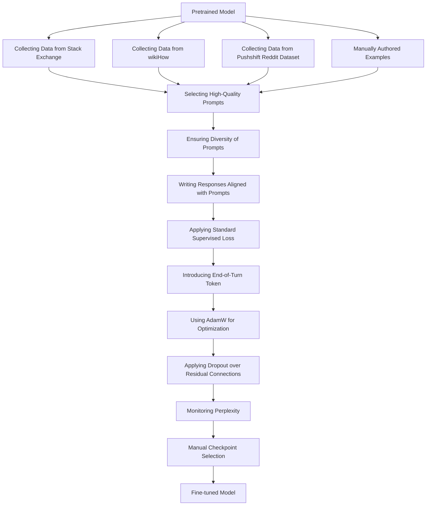

Paper Title: LIMA: Less Is More for Alignment

# Summary

Paper link - https://arxiv.org/pdf/2305.11206.pdf

1. **Abstract & Introduction**: The authors propose LIMA, a 65B parameter language model fine-tuned with the standard supervised loss on only 1,000 carefully curated prompts and responses. They suggest that most knowledge in large language models is learned during pretraining, and only limited instruction tuning data is necessary to produce high-quality output.
2. **Alignment Data & Training LIMA**: The authors collect a dataset of 1,000 prompts and responses, where the outputs (responses) are stylistically aligned with each other, but the inputs (prompts) are diverse. They fine-tune LIMA, starting from a 65B parameter language model, on this alignment training set. They introduce a special end-of-turn token (EOT) at the end of each utterance to differentiate between each speaker (user and assistant).
3. **Human Evaluation & Experiment Setup**: The authors evaluate LIMA by comparing it to state-of-the-art language models and find that it outperforms OpenAI's RLHF-based DaVinci003 and a 65B-parameter reproduction of Alpaca trained on 52,000 examples. They find that 50% of LIMA's outputs are considered excellent.
4. **Results & Analysis**: The results of their human preference study show that, despite training on 52 times more data, Alpaca 65B tends to produce less preferable outputs than LIMA. The same is true for DaVinci003. Bard produces better responses than LIMA 42% of the time; however, this also means that 58% of the time the LIMA response was at least as good as Bard.
5. **Multi-turn Dialogue**: The authors test LIMA across 10 live conversations, labeling each response as Fail, Pass, or Excellent. LIMA responses are surprisingly coherent for a zero-shot chatbot, referencing information from previous steps in the dialogue. However, in 6 out of 10 conversations, LIMA fails to follow the prompt within 3 interactions. To improve its ability to converse, they gather 30 multi-turn dialogue chains and fine-tune a new version of LIMA from the pretrained LLaMa model using the combined 1,030 examples.
6. **Discussion**: The authors show that fine-tuning a strong pretrained language model on 1,000 carefully curated examples can produce remarkable, competitive results on a wide range of prompts. However, there are limitations to this approach. Primarily, the mental effort in constructing such examples is significant and difficult to scale up. Secondly, LIMA is not as robust as product-grade models; while LIMA typically generates good responses, an unlucky sample during decoding or an adversarial prompt can often lead to a weak response.

In summary, the paper presents a novel approach to fine-tuning language models, demonstrating that with careful curation of a small number of examples, it's possible to achieve competitive results. The authors' work challenges the conventional wisdom that large-scale instruction tuning and reinforcement learning are necessary for high-quality language model outputs, and instead proposes a simpler, more efficient method.

# Diagram
