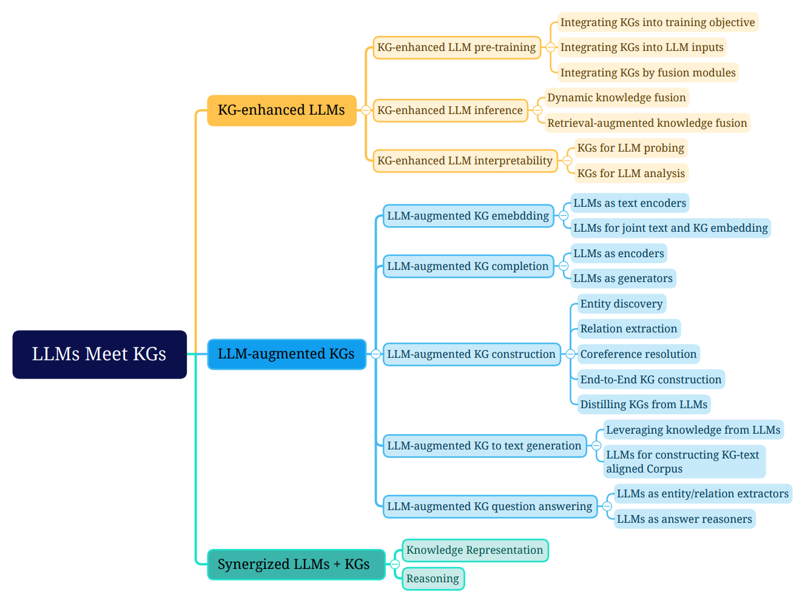

# Paper Title: Unifying Large Language Models and Knowledge Graphs: A Roadmap
Paper link - https://arxiv.org/pdf/2306.08302v1.pdf
<!--
note link - 
Category - 
-->

## Summary
1. **Introduction**: The paper discusses the integration of Large Language Models (LLMs) and Knowledge Graphs (KGs) to leverage the strengths of both. LLMs excel in understanding and generating human-like text, while KGs provide structured and factual knowledge.
2. **KGs for LLMs**: The authors discuss how KGs can be used to enhance LLMs. This can be done through pre-training, where KGs are used to generate training data for LLMs, or through KG-enhanced inference, where KGs are used during the inference stage to guide the LLM's responses.
3. **LLMs for KGs**: The authors discuss how LLMs can be used to enhance KGs. This includes using LLMs to generate embeddings for KGs, for joint text and KG embedding, for KG completion, and for KG construction. The authors also discuss the use of LLMs for KG-to-text generation and KG question answering.
4. **Synergized LLMs + KGs**: The authors discuss the synergy of LLMs and KGs, which combines the merits of both to enhance performance in various downstream applications. This includes knowledge representation and reasoning.
5. **Future Directions**: The authors discuss several future directions for this research area, including using KGs for hallucination detection in LLMs, editing knowledge in LLMs, injecting knowledge into black-box LLMs, using multi-modal LLMs for KGs, developing LLMs that understand KG structure, and synergizing LLMs and KGs for bidirectional reasoning.
6. **Conclusion**: The authors conclude that unifying LLMs and KGs is an active research direction that has attracted increasing attention. They hope that their overview of the recent research in this field can provide a comprehensive understanding and advance future research.

## Diagram
see in original paper https://arxiv.org/pdf/2306.08302v1.pdf

-----

## Detail Notes

**Introduction**

The authors begin by acknowledging the impact of Large Language Models (LLMs) like ChatGPT and GPT4 in the field of natural language processing and artificial intelligence. These models are praised for their generalizability and emergent abilities. However, they also point out the limitations of these models, such as their "black-box" nature and their inability to capture and access factual knowledge effectively.

On the other hand, Knowledge Graphs (KGs) like Wikipedia and Huapu are structured knowledge models that store rich factual knowledge explicitly. They can enhance LLMs by providing external knowledge for inference and interpretability. However, KGs are difficult to construct and evolve, which challenges the existing methods in KGs to generate new facts and represent unseen knowledge.

The authors propose a unification of LLMs and KGs to leverage their advantages. They present a roadmap consisting of three general frameworks:

1. KG-enhanced LLMs: This involves incorporating KGs during the pre-training and inference phases of LLMs, or for the purpose of enhancing understanding of the knowledge learned by LLMs.
2. LLM-augmented KGs: This leverages LLMs for different KG tasks such as embedding, completion, construction, graph-to-text generation, and question answering.
3. Synergized LLMs + KGs: In this framework, LLMs and KGs play equal roles and work in a mutually beneficial way to enhance both LLMs and KGs for bidirectional reasoning driven by both data and knowledge.

**Background**

The authors then delve into the background of LLMs and KGs. They discuss the success of LLMs in various natural language processing (NLP) tasks, such as question answering, machine translation, and text generation. They also mention the emergent abilities of advanced LLMs like ChatGPT and PaLM2 in complex practical tasks, such as education, code generation, and recommendation.

However, they also highlight the criticisms of LLMs, particularly their lack of factual knowledge and interpretability. For example, LLMs might generate factually incorrect statements (a phenomenon known as "hallucination"). They also mention the indecisiveness of LLMs, which perform reasoning by a probability model, making it difficult to interpret or validate the knowledge obtained by them.

The authors suggest incorporating KGs into LLMs as a potential solution to these issues. KGs store facts in a structured and decisive manner, offering accurate explicit knowledge and generating interpretable results. They can also evolve with new knowledge continuously added in. However, KGs are difficult to construct, and current approaches are inadequate in handling the incomplete and dynamically changing nature of real-world KGs.

The authors then discuss the increasing attention towards the possibility of unifying LLMs with KGs. They mention the benefits of KG-enhanced LLMs and LLM-augmented KGs, and also discuss the concept of Synergized LLM + KG, where LLMs and KGs mutually enhance each other's performance in knowledge representation and reasoning.

Finally, they present their main contributions, which include a roadmap for integrating LLMs and KGs, a detailed categorization and review of research on unifying LLMs and KGs, coverage of advanced techniques in both LLMs and KGs, and a summary of challenges and future directions.

**Prompt Engineering**

Prompt engineering is a field that focuses on creating and refining prompts to maximize the effectiveness of LLMs across various applications and research areas. A prompt is a sequence of natural language inputs for LLMs that are specified for a task, such as sentiment classification. A prompt could contain several elements:

1. Instruction: A short sentence that instructs the model to perform a specific task.
2. Context: Provides the context for the input text or few-shot examples.
3. Input Text: The text that needs to be processed by the model.

Prompt engineering seeks to improve the capacity of LLMs in diverse complex tasks such as question answering, sentiment classification, and common sense reasoning. For example, the Chain-of-thought (CoT) prompt enables complex reasoning capabilities through intermediate reasoning steps. Some researchers incorporate external knowledge to design better knowledge-enhanced prompts. Automatic prompt engineering (APE) proposes an automatic prompt generation method to improve the performance of LLMs. Proficiency in prompt engineering leads to a better understanding of the strengths and weaknesses of LLMs.

**Knowledge Graphs (KGs)**

Knowledge graphs (KGs) store structured knowledge as a collection of triples. Existing KGs can be classified into four groups based on the stored information:

1. Encyclopedic KGs: These represent the general knowledge in the real world. They are often constructed by integrating information from diverse and extensive sources, including human experts, encyclopedias, and databases. Examples include Wikidata, Freebase, Dbpedia, YAGO, and NELL.
2. Commonsense KGs: These formulate the knowledge about daily concepts, e.g., objects, and events, as well as their relationships. Examples include ConceptNet, ATOMIC, ASER, TransOMCS, and CausalBanK.
3. Domain-specific KGs: These are constructed to represent knowledge in a specific domain, e.g., medical, biology, and finance. Examples include UMLS, and other domain-specific KGs in finance, geology, biology, chemistry, and genealogy.
4. Multi-modal KGs: These represent facts in multiple modalities such as images, sounds, and videos. Examples include IMGpedia, MMKG, and Richpedia.

**Applications**

LLMs and KGs have been widely applied in various real-world applications. Examples include ChatGPT/GPT-4, ERNIE 3.0, Bard, Firefly, Copilot, New Bing, and Shop.ai. Wikidata and KO are two representative knowledge graph applications that are used to provide external knowledge. AliOpenKG is a knowledge graph designed for recommendation. Doctor.ai develops a healthcare assistant that incorporates LLMs and KGs to provide medical advice.

**Roadmap & Categorization**

The authors present a roadmap of explicit frameworks that unify LLMs and KGs. They identify three frameworks for the unification of LLMs and KGs, including KG-enhanced LLMs, LLM-augmented KGs, and Synergized LLMs + KGs.

1. KG-enhanced LLMs: LLMs are renowned for their ability to learn knowledge from large-scale corpus and achieve state-of-the-art performance in various NLP tasks. However, they are often criticized for their hallucination issues and lack of interpretability. To address these issues, researchers have proposed to enhance LLMs with knowledge graphs (KGs).
2. LLM-augmented KGs: KGs store structured knowledge playing an essential role in many real-word applications.

**Integrating KGs into Training Objective**

The authors discuss various methods of integrating KGs into the training objectives of LLMs. For instance, GLM assigns a higher masking probability during pre-training to entities that can be reached within a certain number of hops in the KG structure. E-BERT controls the balance between token-level and entity-level training losses. SKEP injects sentiment knowledge during LLMs pre-training by assigning a higher masking probability to identified sentiment words.

Other works focus on leveraging the connections between knowledge and input text. ERNIE, for example, proposes a novel word-entity alignment training objective as a pre-training objective. KALM enhances the input tokens by incorporating entity embeddings and includes an entity prediction pre-training task. KEPLER employs both knowledge graph embedding training objective and Masked token pre-training objective into a shared transformer-based encoder.

**Integrating KGs into LLM Inputs**

This line of research focuses on introducing relevant knowledge sub-graph into the inputs of LLMs. ERNIE 3.0 represents the KG triple as a sequence of tokens and directly concatenates them with the sentences. K-BERT injects the knowledge triple into the sentence via a visible matrix where only the knowledge entities have access to the knowledge triple information. Colake proposes a unified word-knowledge graph where the tokens in the input sentences form a fully connected word graph where tokens aligned with knowledge entities are connected with their neighboring entities.

**Integrating KGs by Additional Fusion Modules**

By introducing additional fusion modules into LLMs, the information from KGs can be separately processed and fused into LLMs. ERNIE proposes a textual-knowledge dual encoder architecture where a T-encoder first encodes the input sentences, then a K-encoder processes knowledge graphs which are fused them with the textual representation from the T-encoder. BERT-MK employs a similar dual-encoder architecture but it introduces additional information of neighboring entities in the knowledge encoder component during the pre-training of LLMs.

**KG-enhanced LLM Inference**

The authors discuss the need for methods that allow for updates to the incorporated knowledge without retraining the model. They discuss Dynamic Knowledge Fusion, where a two-tower architecture is used, and Retrieval-Augmented Knowledge Fusion, where RAG proposes to combine non-parametric and parametric modules to handle the external knowledge.

**KG-enhanced LLM Interpretability**

The authors discuss the need for improving the interpretability of LLMs. They discuss two categories of methods: KGs for language model probing, and KGs for language model analysis. LAMA is the first work to probe the knowledge in LLMs by using KGs. It converts the facts in KGs into cloze statements by a predefined prompt template and then uses LLMs to predict the missing entity. The prediction results are used to evaluate the knowledge stored in LLMs.

**LLM-augmented KG Embedding**

The authors discuss how LLMs can be used to generate embeddings for KGs. Pretrain-KGE uses a LLM encoder to encode the textual descriptions of entities and relations into representations. KEPLER offers a unified model for knowledge embedding and pre-trained language representation. Nayyeri et al. use LLMs to generate the world-level, sentence-level, and document-level representations. Huang et al. combine LLMs with other vision and graph encoders to learn multi-modal knowledge graph embedding. CoDEx presents a novel loss function empowered by LLMs that guides the KGE models in measuring the likelihood of triples by considering the textual information.

**LLMs for Joint Text and KG Embedding**

Instead of using KGE model to consider graph structure, another line of methods directly employs LLMs to incorporate both the graph structure and textual information into the embedding space simultaneously. kNN-KGE treats the entities and relations as special tokens in the LLM. During training, it transfers each triple and corresponding text descriptions into a sentence and then finetunes the model to predict the masked entity. LMKE proposes a contrastive learning method to improve the learning of embeddings generated by LLMs for KGE. LambdaKG samples 1-hop neighbor entities and concatenates their tokens with the triple as a sentence feeding into LLMs.

**LLM-augmented KG Completion**

Knowledge Graph Completion (KGC) refers to the task of inferring missing facts in a given knowledge graph. The recent integration of LLMs enables KGC methods to encode text or generate facts for better KGC performance. These methods fall into two distinct categories based on their utilization styles: 1) LLM as Encoders (PaE), and 2) LLM as Generators (PaG).

**LLM as Encoders (PaE)**

This line of work first uses encoder-only LLMs to encode textual information as well as KG facts. Then, they predict the plausibility of the triples by feeding the encoded representation into a prediction head, which could be a simple MLP or conventional KG score function. KG-BERT represents a triple as a text sequence and encodes it with LLM. The final hidden state of the [CLS] token is fed into a classifier to predict the possibility of the triple. MTL-KGC proposed a Multi-Task Learning for the KGC framework which incorporates additional auxiliary tasks into the model's training. PKGC assesses the validity of a triplet by transforming the triple and its supporting information into natural language sentences with pre-defined templates. LASS observes that language semantics and graph structures are equally vital to KGC. As a result, LASS is proposed to jointly learn two types of embeddings: semantic embedding and structure embedding.

**LLM as Generators (PaG)**

LLMs as Generators (PaG) is another approach that does not need a prediction head and can be used without finetuning or access to representations. Therefore, the framework of PaG is suitable for all kinds of LLMs. In addition, PaG directly generates the tail entity, making it efficient in inference without ranking all the candidates and easily generalizing to unseen entities. But, the challenge of PaG is that the generated entities could be diverse and not lie in KGs. Furthermore, the time of a single inference is longer due to the auto-regressive generation. Last, how to design a powerful prompt that feeds KGs into LLMs is still an open question. Consequently, while PaG has demonstrated promising results for KGC tasks, the trade-off between model complexity and computational efficiency must be carefully considered when selecting an appropriate LLM-based KGC framework.

**Model Analysis**

The authors discuss a comprehensive analysis of KGC methods integrated with LLMs. Their research investigates the quality of LLM embeddings and finds that they are suboptimal for effective entity ranking. In response, they propose several techniques for processing embeddings to improve their suitability for candidate retrieval. The study also compares different model selection dimensions, such as Embedding Extraction, Query Entity Extraction, and Language Model Selection. Lastly, the authors propose a framework that effectively adapts LLM for knowledge graph completion.

**LLM-augmented KG-to-text Generation**

The goal of Knowledge-graph-to-text (KG-to-text) generation is to generate high-quality texts that accurately and consistently describe the input knowledge graph information. KG-to-text generation connects knowledge graphs and texts, significantly improving the applicability of KG in more realistic NLG scenarios, including storytelling and knowledge-grounded dialogue. However, it is challenging and costly to collect large amounts of graph-text parallel data, resulting in insufficient training and poor generation quality. Thus, many research efforts resort to either: 1) leverage knowledge from LLMs or 2) construct large-scale weakly-supervised KG-text corpus to solve this issue.

**Leveraging Knowledge from LLMs**

As pioneering research efforts in using LLMs for KG-to-Text generation, Ribeiro et al. and Kale and Rastogi directly fine-tune various LLMs, including BART and T5, with the goal of transferring LLMs knowledge for this task. Both works simply represent the input graph as a linear traversal and find that such a naive approach successfully outperforms many existing state-of-the-art KG-to-text generation systems. Interestingly, Ribeiro et al. also find that continue pre-training could further improve model performance. However, these methods are unable to explicitly incorporate rich graph semantics in KGs. To enhance LLMs with KG structure information, JointGT proposes to inject KG structure-preserving representations into the Seq2Seq large language models. Given input sub-KGs and corresponding text, JointGT first represents the KG entities and their relations as a sequence of tokens, then concatenate them with the textual tokens which are fed into LLM. After the standard self-attention module, JointGT then uses a pooling layer to obtain the contextual semantic representations of knowledge entities and relations. Finally, these pooled KG representations are then aggregated in another structure-aware self-attention layer. JointGT also deploys additional pre-training objectives, including KG and text reconstruction tasks given masked inputs, to improve the alignment between text and graph information. Li et al. also provide a 1,000+ human annotated KG-to-Text test data to verify the effectiveness of the pre-trained KG-to-Text models. Similarly, Chen et al. also propose a KG-grounded text corpus collected from the English Wikidump. To ensure the connection between KG and text, they only extract sentences with at least two Wikipedia anchor links. Then, they use the entities from those links to query their surrounding neighbors in WikiData and calculate the lexical overlapping between these neighbors and the original sentences. Finally, only highly overlapped pairs are selected. The authors explore both graph-based and sequence-based encoders and identify their advantages in various different tasks and settings.

**LLM-augmented KG Question Answering**

Knowledge graph question answering (KGQA) aims to find answers to natural language questions based on the structured facts stored in knowledge graphs. The inevitable challenge in KGQA is to retrieve related facts and extend the reasoning advantage of KGs to QA. Therefore, recent studies adopt LLMs to bridge the gap between natural language questions and structured knowledge graphs. The general framework of applying LLMs for KGQA is illustrated in Fig. 24, where LLMs can be used as 1) entity/relation extractors, and 2) answer reasoners.

**LLMs as Entity/relation Extractors**

Entity/relation extractors are designed to identify entities and relationships mentioned in natural language questions and retrieve related facts in KGs. Given the proficiency in language comprehension, LLMs can be effectively utilized for this purpose.

**Future Directions**

The authors discuss several future directions for this research area:

1. **KGs for Hallucination Detection in LLMs**: The hallucination problem in LLMs, which generates factually incorrect content, significantly hinders the reliability of LLMs. The authors suggest that KGs can be used as an external source to validate LLMs and detect hallucinations.
2. **KGs for Editing Knowledge in LLMs**: The authors highlight the need for methods that allow for updates to the incorporated knowledge without retraining the model. They discuss the challenges of such methods, such as catastrophic forgetting and incorrect knowledge editing.
3. **KGs for Black-box LLMs Knowledge Injection**: The authors discuss the challenge of injecting knowledge into black-box LLMs, which only provide APIs for users and developers to access, making themselves black-box to the public. They suggest that converting various types of knowledge into different text prompts seems to be a feasible solution.
4. **Multi-Modal LLMs for KGs**: The authors discuss the need for methods that can accurately encode and align entities across different modalities. They suggest that multi-modal LLMs hold promise in this regard.
5. **LLMs for Understanding KG Structure**: The authors discuss the need for LLMs that can directly understand the KG structure and reason over it.
6. **Synergized LLMs and KGs for Bidirectional Reasoning**: The authors discuss the need for methods that leverage the strengths of both LLMs and KGs to overcome their individual limitations. They suggest that such methods can be applied to many real-world applications, such as search engines, recommender systems, and drug discovery.

**Conclusion**

In conclusion, the authors provide a thorough overview of the recent research in the field of unifying large language models (LLMs) and knowledge graphs (KGs). They discuss different manners that integrate KGs to enhance LLMs and existing methods that apply LLMs for KGs. They also discuss the challenges and future directions in this field. They hope this article can provide a comprehensive understanding of this field and advance future research.